# Rideau Canal IoT Monitoring System  
Main Documentation – CST8916 Final Project

## Student Information
- **Name:** Jigarkumar Dilipkumar Patel
- **Student ID:** 041169204
- **Course:** CST8916 - Fall 2025

## Repository Links

### 1. Main Documentation Repository
- **URL:** <a href="https://github.com/Jigarkumar25/rideau-canal-monitoring" target="_blank">Click here</a>  
- **Description:** Complete project documentation, architecture, screenshots, and guides  

### 2. Sensor Simulation Repository
- **URL:** <a href="https://github.com/Jigarkumar25/rideau-canal-sensor-simulation" target="_blank">Click here</a>  
- **Description:** IoT sensor simulator code  

### 3. Web Dashboard Repository
- **URL:** <a href="https://github.com/Jigarkumar25/rideau-canal-dashboard" target="_blank">Click here</a>  
- **Description:** Web dashboard application  

## Demo
- **Video Demo:** <a href="https://youtu.be/sS87jm-ulbs" target="_blank">Click here</a>


## Project Overview  
This project implements a real-time IoT-based monitoring system for the Rideau Canal Skateway.  
It uses simulated sensors, Azure IoT Hub, Azure Stream Analytics, Azure Cosmos DB, Azure Blob Storage, and a live Web Dashboard.  
The system monitors ice thickness, temperature, and snow accumulation to help determine skating safety conditions.

---


### System Objectives  
- Collect sensor data continuously  
- Process streaming data automatically  
- Store real-time and historical data  
- Display live conditions on a web dashboard  
- Support safety decisions using real-time analytics  

---

## System Architecture  

### Architecture Diagram   

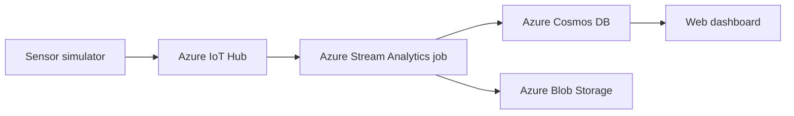

### Data Flow Explanation  
1. Sensor simulator sends telemetry to Azure IoT Hub  
2. IoT Hub forwards data to Azure Stream Analytics  
3. Stream Analytics aggregates data every 5 minutes  
4. Aggregated data is stored in:
   - Azure Cosmos DB for real-time access
   - Azure Blob Storage for historical storage
5. The Web Dashboard fetches live data from Cosmos DB  

### Azure Services Used  
- Azure IoT Hub  
- Azure Stream Analytics  
- Azure Cosmos DB  
- Azure Blob Storage  
- Azure Storage Account  


---

## Implementation Overview  

### IoT Sensor Simulation  
A Python-based simulator generates random sensor readings for three locations (Dows Lake, Fifth Avenue, NAC) and sends the data to Azure IoT Hub.

### Azure IoT Hub Configuration  
The IoT Hub receives all telemetry from the simulated devices and forwards it to the Stream Analytics job using the messaging endpoint.

### Stream Analytics Job  
The Stream Analytics job reads data from IoT Hub, aggregates five-minute windows, assigns a safety status, and outputs to Cosmos DB and Blob Storage.

### Stream Analytics Query

```sql
SELECT
    deviceId,
    location,
    AVG(iceThickness) AS avgIceThickness,
    AVG(temperature) AS avgTemperature,
    AVG(snowDepth) AS avgSnowDepth,
    System.Timestamp AS windowEndTime,
    CASE
        WHEN AVG(iceThickness) >= 30
             AND AVG(temperature) <= 0
             AND AVG(snowDepth) <= 5
            THEN 'Safe'
        WHEN AVG(iceThickness) >= 20
             AND AVG(temperature) <= 0
             AND AVG(snowDepth) <= 10
            THEN 'Caution'
        ELSE 'Unsafe'
    END AS safetyStatus,
    CONCAT(location, '_', FORMAT(System.Timestamp, 'yyyyMMddHHmmss')) AS id
INTO CosmosDBOutput
FROM IoTHubInput
GROUP BY location, deviceId, TumblingWindow(minute, 5);

SELECT
    *
INTO BlobOutput
FROM CosmosDBOutput;
```

### Azure Cosmos DB Setup  
Cosmos DB stores live aggregated sensor data for fast access by the web dashboard.  
Database name: RideauCanalDB  
Container name: SensorAggregations  
Partition Key: /location  

### Azure Blob Storage Configuration  
Blob Storage stores historical JSON files of aggregated data.  
Container name: historical-data  

### Web Dashboard  
A Node.js and Express-based dashboard fetches real-time data from Cosmos DB and displays the current conditions for each location.

### Azure App Service Deployment  
The dashboard is deployed to Azure App Service using environment variables for secure database access.

### Environment Variables Used  

The following environment variables are used by the dashboard:

- COSMOS_ENDPOINT  
- COSMOS_KEY  
- COSMOS_DATABASE  
- COSMOS_CONTAINER  
- PORT  

---

## Setup Instructions  

### Prerequisites  
- Azure Subscription  
- Python 3  
- Node.js  
- Git  

### High-Level Setup Steps  
1. Run the sensor simulator  
2. Verify data in IoT Hub  
3. Start the Stream Analytics job  
4. Verify Cosmos DB records  
5. Verify Blob Storage files  
6. Run the dashboard locally  
7. Deploy the dashboard to Azure  

---


## Screenshots

### IoT Hub Created
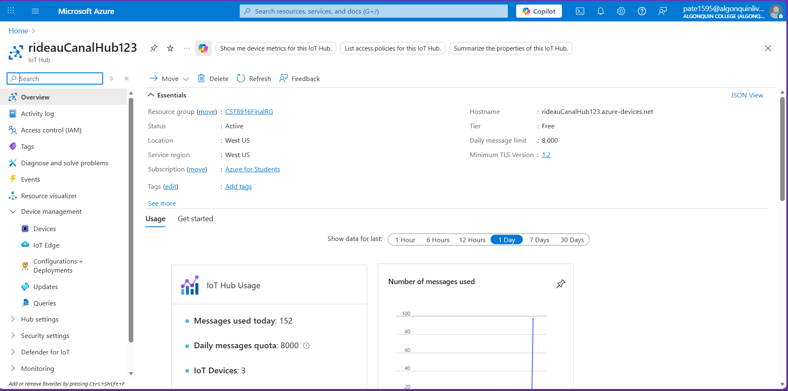

### IoT Devices List
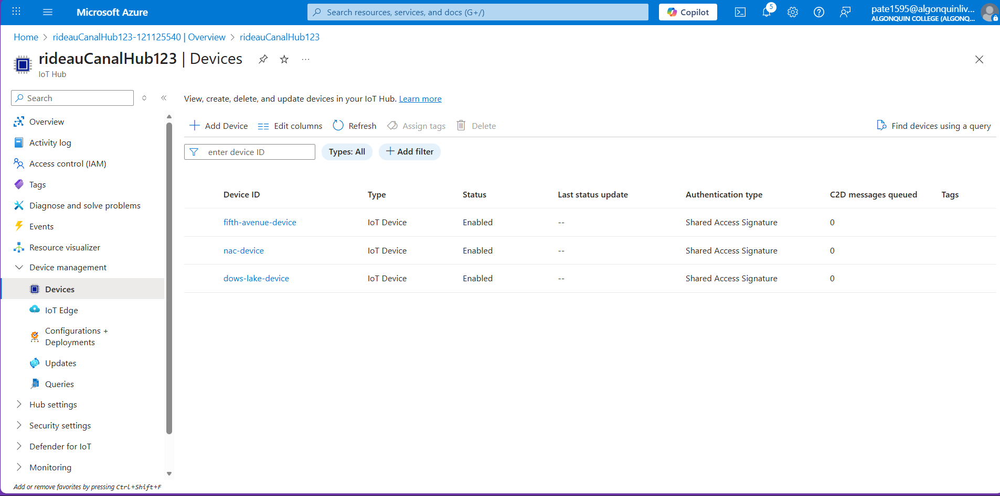

### Stream Analytics Job Created
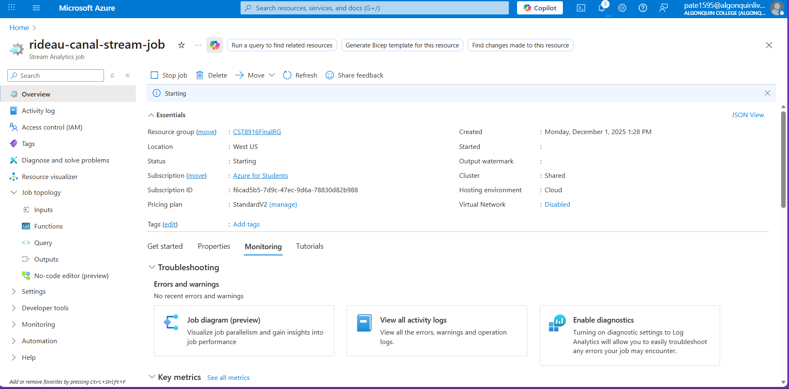

### Stream Input from IoT Hub
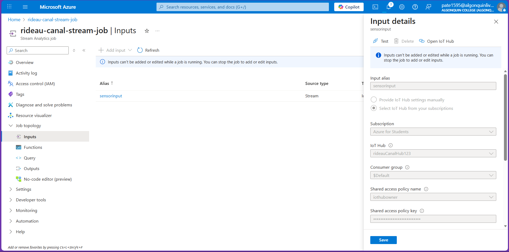

### Cosmos DB Account Created
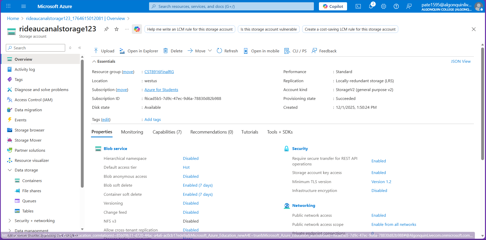

### Cosmos Database and Container
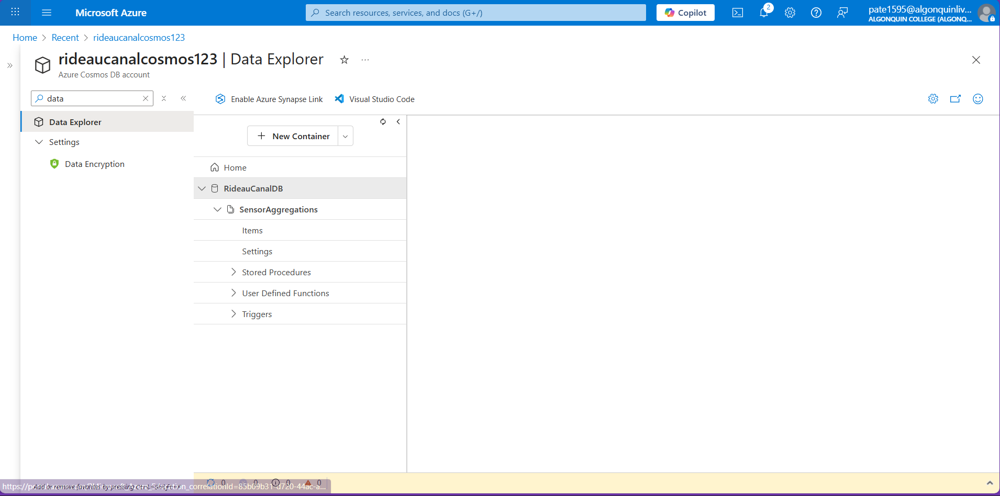

### Stream Output to Cosmos DB
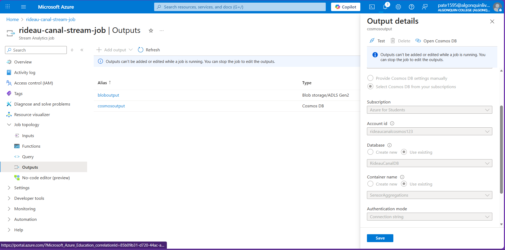

### Blob Storage Container Created
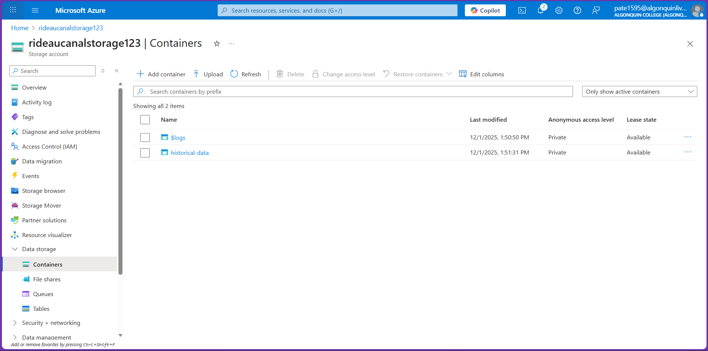

### Stream Output to Blob Storage
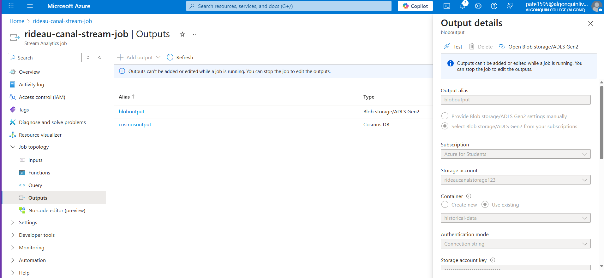

### Stream Analytics SQL Query
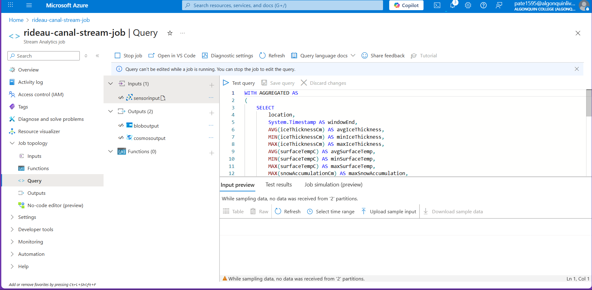

### Stream Analytics Job Running
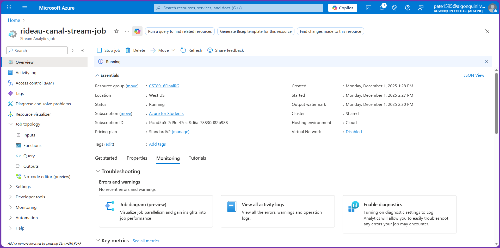

### Sensor Simulator Running
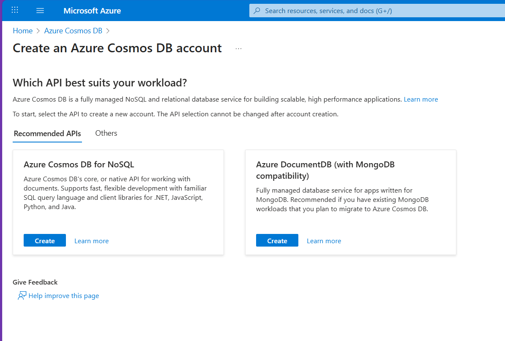

### IoT Hub Metrics
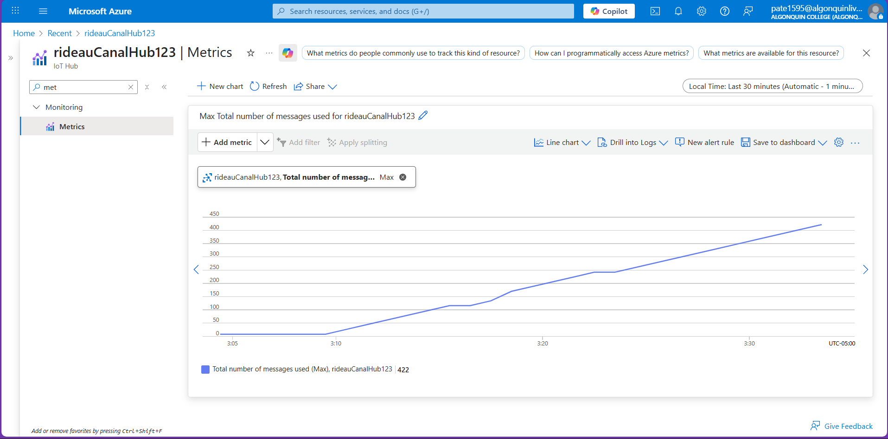

### Cosmos DB Data Items
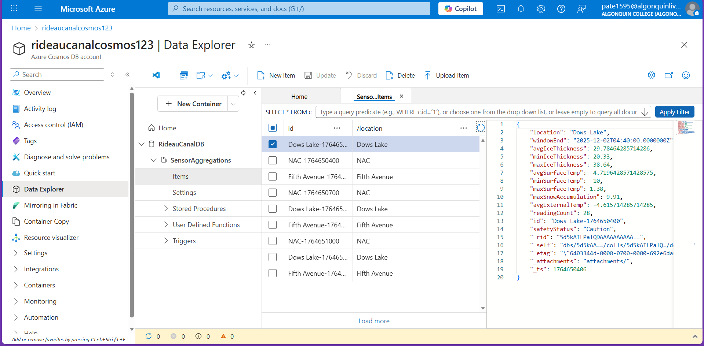

### Blob Storage JSON Files
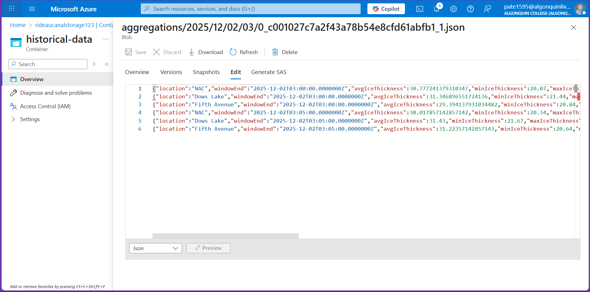

### API Readings Output
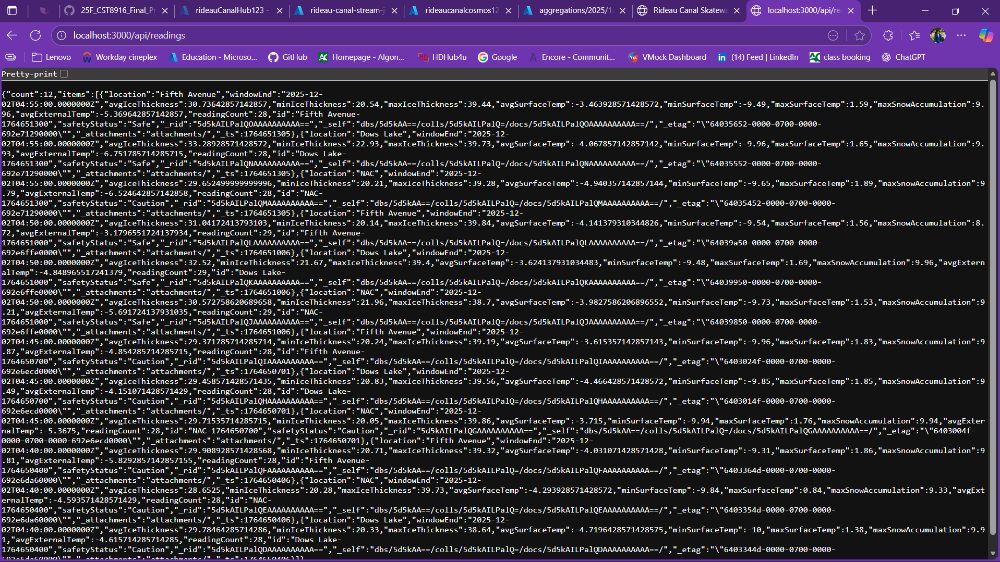

### Live Dashboard Frontend
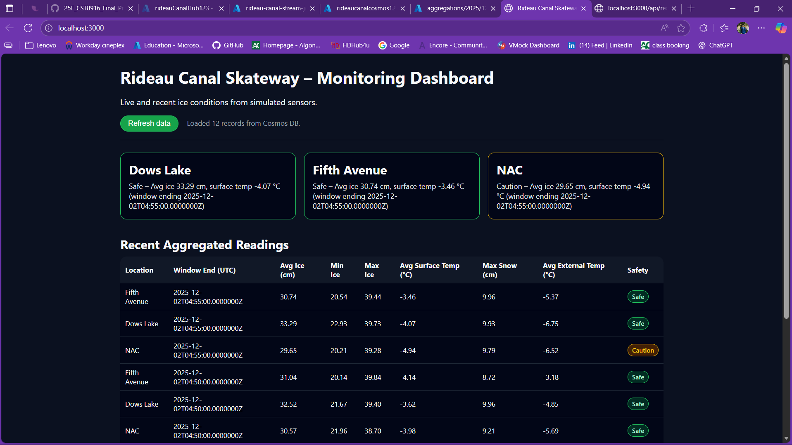

## Results and Analysis  
### Sample Outputs  
- Real-time data visible in Cosmos DB  
- Historical JSON files created in Blob Storage  
- Live values displayed on the dashboard  

### System Performance Observations  
- Real-time streaming with low latency  
- Continuous stable data flow  
- Fast query response from Cosmos DB  

---

## Challenges and Solutions  

### Cosmos DB ID Error  
Cause: Missing document ID in Stream Analytics output  
Solution: Added a unique ID using location and timestamp  

### Partition Key Mismatch  
Cause: Container created with the wrong partition key  
Solution: Recreated the container with `/location` as the partition key  

### Dashboard Data Not Loading  
Cause: Incorrect environment variable configuration  
Solution: Corrected `.env` values and restarted the server  

---

## AI Tools Disclosure  
ChatGPT was used for documentation wording, debugging guidance, sql query , and error explanation.  
All Azure configuration, coding, and testing were completed manually by me.

---
## Conclusion  

This project successfully demonstrates a real-time IoT monitoring system using Microsoft Azure services. Live sensor data is securely ingested through Azure IoT Hub, processed using Stream Analytics, stored in Cosmos DB for real-time access and Azure Blob Storage for historical analysis, and visualized through a live web dashboard. This project provided hands-on experience with IoT data pipelines, cloud analytics, and full-stack cloud deployment.

--- 

## References  

- Microsoft Azure IoT Hub Documentation  
  https://learn.microsoft.com/en-us/azure/iot-hub/  

- Microsoft Azure Stream Analytics Documentation  
  https://learn.microsoft.com/en-us/azure/stream-analytics/  

- Azure Cosmos DB Documentation  
  https://learn.microsoft.com/en-us/azure/cosmos-db/  

- Azure Blob Storage Documentation  
  https://learn.microsoft.com/en-us/azure/storage/blobs/  

- Node.js Express Documentation  
  https://expressjs.com/  
